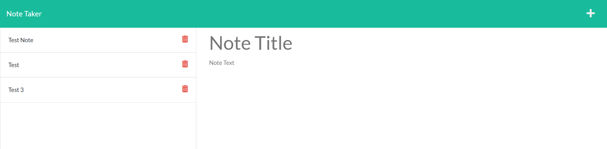

<br>
<p align="center">
   <h2 align="center">Note Taker</h2>
</p>
<br>
  <details open="open">
  <summary><h2 style="display: inline-block">Table of Contents</h2></summary>
  <ol>
    <li>
      <a href="#about-the-project">About The Project</a>
      <ul>
        <li><a href="#built-with">Built With</a></li>
      </ul>
    </li>
    <li><a href="#testing">Testing</a></li>
    <li><a href="#contact">Contact</a></li>
  </ol>
  </details>
  <br>

## About the project
This is a note taking site that uses server side code and storage to add and save notes inputted by the user. Using express.js, this app allows users to write notes and save them so that reloading the page doesn't remove the entered notes. All entered notes are stored in a notes.json file using this post method allowing for future reference.

### Built With

* Javascript
* Node.js
* Express.js

### Testing

To access the site, simply visit https://infinite-bayou-35594.herokuapp.com/ to get started with taking a saving notes.

To access the code for the note taker:

* Clone the repo

    ```sh
    git clone https://github.com/Zd092718/notetaker
    ```


### Preview Screenshot
<br>




## Contact

Zachary Dowd - zdowd2796@gmail.com

Github Profile - https://github.com/Zd092718
